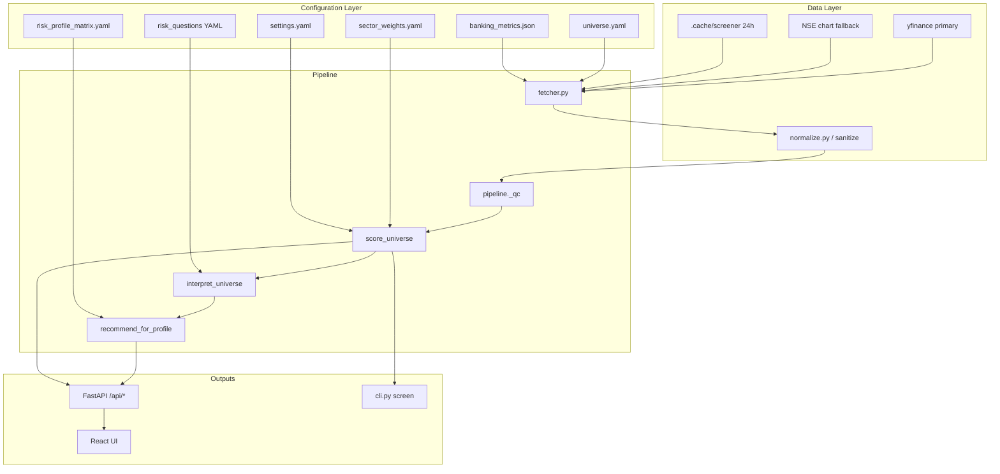

# Stock Screener — Scoring, Sectors & Architecture

This document describes how the full-universe NSE screener fetches data, assigns sectors, scores stocks, produces recommendations, and matches results to user risk profiles.

**Current scale:** ~181 tickers across 8 sector buckets (as of `universe.yaml`).

---

## 1. High-level architecture



### Design principles

1. **Sectors are curated, not fetched from Yahoo.** Each ticker’s bucket (`sector_focus`), scoring model, and peer group come from `universe.yaml`. yfinance supplies prices and fundamentals only.
2. **Two scoring engines:** *deep* (Banking, IT) and *standard* (all other buckets), with sector-specific factor weights for standard names.
3. **Peer-relative ranking:** Composite scores are ranked within peer cohorts; percentiles drive relative rank, not absolute quality alone.
4. **Three-axis recommendations (v3):** Absolute quality grade, peer band, and profile fit are kept distinct before producing the final action label.
5. **Rule-based inference:** No LLM; all signals and narratives come from YAML rules and deterministic Python.

---

## 2. Sector taxonomy

### 2.1 Eight buckets (`sector_focus`)

| Bucket | `model_sector` | Display label | Analysis depth | Cyclical | Peer group |
|--------|----------------|---------------|----------------|----------|------------|
| `banking` | BANKING | Financial Services | **deep** | No | Private vs PSU sub-cohorts |
| `it` | IT | Technology | **deep** | No | All IT tickers |
| `fmcg` | FMCG | Consumer Defensive | standard | No | FMCG tickers |
| `pharma` | PHARMA | Healthcare | standard | No | Pharma tickers |
| `auto` | AUTO | Consumer Cyclical | standard | **Yes** | Auto tickers |
| `energy` | ENERGY | Energy | standard | **Yes** | Energy tickers |
| `metals` | METALS | Basic Materials | standard | **Yes** | Metals tickers |
| `capital_goods` | CAPITAL_GOODS | Industrials | standard | **Yes** | Capital goods tickers |

Defined in: `screener/config/universe.yaml`  
Loaded by: `screener/config_loader.py` (`ticker_index()`, `peer_set()`, `sector_focus_for_ticker()`)

### 2.2 Why sectors are not from yfinance

Yahoo’s `sector` / `industry` fields are **not used**. Reasons:

- Indian NSE symbols often have missing or US-style labels.
- The system needs **custom metadata**: `analysis_depth`, `cyclical`, `bank_cohort` (private/PSU), and scoring weights.
- Peer groups must align with Indian market conventions (e.g. PSU banks vs private banks).

The `sector` field on `StockMetrics` is the **display label** from config (e.g. “Technology”), not a live Yahoo lookup.

### 2.3 Peer cohorts (`peer_set`)

| Cohort key | Peers |
|------------|-------|
| `banking_private` | All private banks in universe |
| `banking_psu` | All PSU banks in universe |
| `it` | All IT tickers |
| `{bucket}` | All tickers in same bucket (fmcg, pharma, …) |

Banking percentiles are computed **within private or PSU**, not across all 31 banks together.

Implementation: `config_loader.peer_set()` → used by `score_universe()` in `composite.py`.

---

## 3. Data layer

### 3.1 Sources

| Data | Primary source | Override / fallback |
|------|----------------|---------------------|
| Price history (5y) | yfinance `Ticker.history()` | NSE India chart API if rows &lt; min |
| PE, PB, ROE, margins, market cap | yfinance `get_info()` | — |
| Financial statements | yfinance income/balance/cashflow | Used for CAGR, credit growth |
| GNPA, NNPA, CAR, NIM (banks) | **Curated** `banking_metrics.json` | Overrides yfinance when present |
| Sector assignment | **`universe.yaml`** | Never from Yahoo |

### 3.2 Fetch flow

File: `screener/data/fetcher.py`

1. Resolve ticker metadata from `universe.yaml`.
2. Try yfinance symbols via `ticker_aliases.yaml` (e.g. `M&M.NS`, `CUB.NS`).
3. Pull `get_info()`, statements, and 5y history.
4. Compute returns, beta, volatility, drawdown vs Nifty (`^NSEI`).
5. For banks: `enrich_banking_metrics()` merges curated ratios.
6. `sanitize_metrics()` / `normalize.py` clamp bad values (ROE, PE, D/E).
7. Cache JSON for 24h under `.cache/screener/`.

### 3.3 Quality control (QC)

File: `screener/pipeline.py` → `_qc()`

A ticker is **dropped** if:

- Fetch failed
- Unknown bucket
- Price history &lt; `min_price_history_rows` (default 20)
- Both PE and PB missing
- Data completeness &lt; `min_completeness` (default 0.35)

Deep sectors have tailored completeness rules (e.g. IT allows growth fallback via `effective_revenue_cagr()`).

---

## 4. Pipeline orchestration

File: `screener/pipeline.py`

```
fetch_all_metrics → QC filter → enrich_sector_relative_momentum → score_universe → interpret_universe
```

| Stage | Module | Output |
|-------|--------|--------|
| Fetch | `data/fetcher.py` | `Dict[ticker, StockMetrics]` |
| QC | `pipeline._qc` | `valid` metrics + `dropped` list |
| Momentum enrich | `scoring/peer_stats.py` | Sets `rs_vs_sector_pct` per bucket |
| Score | `scoring/composite.py` | `Dict[ticker, ScoreResult]` |
| Interpret | `interpret/engine.py` | `Dict[ticker, StockInterpretation]` |
| Recommend | `interpret/risk_matcher.py` | `RecommendationResult` for user profile |

Global singleton: `STATE = ScreenState()` (used by FastAPI).

---

## 5. Scoring mechanics

### 5.1 Routing (`score_universe`)

File: `screener/scoring/composite.py`

```
for each peer group:
  if deep + banking  → _score_banking()
  elif deep + it     → _score_it()
  else               → score_generic_group()  # generic.py
```

Each group produces:

- `composite_score` (0–100)
- `fundamental_strength` (0–1)
- `valuation_label` (Under / Fair / Over / Unknown)
- `composite_percentile` (0–100 within peers, winsorized + shrunk)
- `peer_rank`, `peer_count`
- `red_flag`, `hard_gate_fail`, `risk_flags`
- **v3:** `quality_grade`, `peer_band`, `recommendation` via `action_matrix.py`

### 5.2 Shared factor utilities

File: `screener/scoring/factors.py`

| Function | Purpose |
|----------|---------|
| `soft_score_higher` / `soft_score_lower` | Map metric to 0–1 using good/bad thresholds |
| `percentile_rank` | Peer percentile 0–100; optional winsorization (5th–95th) |
| `weighted_mean` | Composite factor blend; ignores missing factors |
| `winsorize` | Reduces outlier distortion in peer ranks |

Settings: `winsor_low`, `winsor_high`, `min_peers_for_rank` in `settings.yaml`.

**Percentile shrinkage:** For peer groups smaller than `min_peers_for_rank` (default 10), raw percentiles are blended toward 50 via `shrink_percentile()` in `peer_stats.py`.

---

## 6. Sector-specific scoring

### 6.1 Banking (deep)

**Weights** (`settings.yaml` → `composite_weights.banking`):

| Factor | Weight | Inputs |
|--------|--------|--------|
| Asset quality | 30% | GNPA, NNPA, CAR + GNPA peer percentile |
| Franchise | 25% | NIM, ROA, ROE + peer percentiles |
| Valuation | 25% | P/B–ROE residual (see below) |
| Momentum | 10% | 6m return percentile or RS vs sector/Nifty |
| Risk penalty | 10% | Max drawdown percentile |

**Valuation:** `banking_valuation.py` regresses P/B on ROE within peer cohort. Negative residual → cheap vs ROE; maps to Under/Fair/Over.

**Hard gates** (`_hard_gate_banking`):

- GNPA ≥ 3.5%
- NNPA ≥ 1.2%
- CAR &lt; 12%

**Curated data:** GNPA/NNPA/CAR/NIM from `banking_metrics.json`. Flag `stale_banking_curated` if JSON `as_of` &gt; 120 days.

**Risk questions:** 7 questions (`banking_risk_questions.yaml`) — asset quality, capital, NIM, loan growth, valuation, distress, earnings.

---

### 6.2 IT (deep)

**Weights** (`composite_weights.it`):

| Factor | Weight | Inputs |
|--------|--------|--------|
| Margin quality | 25% | Operating margin, margin trend, ROE |
| Growth | 30% | Revenue CAGR (with fallback), YoY revenue/profit growth |
| Valuation | 25% | PEG, P/E vs peers, FCF yield, earnings yield |
| Momentum | 10% | 6m return percentile or RS |
| Risk penalty | 10% | Drawdown percentile |

**Valuation:** PEG &lt; 1.2 → Under; PEG &gt; 2.5 or P/E &gt; 1.15× peer median → Over.

**Hard gates** (`_hard_gate_it`):

- Operating margin &lt; 0
- ROE &lt; 0
- D/E &gt; 2.5

**Growth fallbacks:** `growth.py` → `effective_revenue_cagr()` / `effective_profit_cagr()` when 3y CAGR missing.

**Risk questions:** 7 questions (`it_risk_questions.yaml`) — margins, margin trend, revenue growth, PEG, leverage, client concentration proxy, data quality.

---

### 6.3 Standard sectors (generic engine)

File: `screener/scoring/generic.py`  
Weights: `screener/config/sector_weights.yaml` per `model_sector`

**Base factor pillars** (all standard sectors):

| Pillar | Typical inputs |
|--------|----------------|
| Quality | ROE, ROCE, operating margin, D/E, interest coverage, peer ROE rank |
| Growth | 3y revenue/profit CAGR (with fallbacks), YoY growth, margin trend, revenue acceleration |
| Value | P/E peer percentile, earnings yield, FCF yield |
| Momentum | 6m return percentile or RS vs sector |
| Risk penalty | Drawdown percentile or downside deviation |
| Cashflow | *(Energy only)* FCF, dividend yield |

**Sector weight overrides** (examples):

| Sector | Quality | Growth | Value | Momentum | Notes |
|--------|---------|--------|-------|----------|-------|
| FMCG | 35% | 15% | 25% | 10% | ROCE, EBITDA margin overlays |
| PHARMA | 35% | 25% | 20% | 10% | Interest coverage, D/E |
| AUTO | 25% | 25% | 25% | 15% | Cyclical |
| ENERGY | 28% | 12% | 28% | 12% | Cashflow pillar 18% |
| METALS | 22% | 18% | 32% | 15% | Value-heavy |
| CAPITAL_GOODS | 30% | 30% | 20% | 10% | Revenue growth overlay |

**Valuation:** `valuation.py` — multi-metric vote (P/E, P/B, EV/EBITDA z-scores vs peers). Cyclical sectors apply margin-peak penalty (downgrades false “cheap”).

**Hard gates (generic):**

- ROE &lt; -5%, op margin &lt; -2%, D/E &gt; 3 (4 for FMCG/pharma), interest coverage &lt; 0.8

**Risk questions:** 5 generic questions (`generic_risk_questions.yaml`) with sector overrides in `sector_risk_overrides.yaml` (e.g. softer ROE bands for cyclicals, FMCG-specific GQ3).

---

## 7. Recommendation engine (v3 — three axes)

Recommendations are **not** peer percentile alone. Three axes are computed, then merged in `action_matrix.py`.

### 7.1 Axis 1 — Absolute quality

File: `screener/scoring/quality_grade.py`

```
quality_score = 0.45 × fundamental_strength
              + 0.40 × (composite_score / 100)
              + 0.15 × data_completeness
```

| Grade | Criteria |
|-------|----------|
| A | quality ≥ 0.75, no red flag |
| B | quality ≥ 0.55 |
| C | quality ≥ 0.40 |
| D | Below C or red flag with low quality |
| F | hard_gate_fail |

### 7.2 Axis 2 — Relative peer rank

From `composite_percentile` (within peer cohort):

| Band | Percentile |
|------|------------|
| Top | ≥ 70 |
| Upper-Mid | 50–70 |
| Lower-Mid | 30–50 |
| Bottom | &lt; 30 |

### 7.3 Axis 3 — Action label

File: `screener/scoring/action_matrix.py`

Decision logic (simplified):

1. **Hard gate fail** → SELL if Over, else AVOID  
2. **Grade A/B + Top/Upper-Mid + not Over** → STRONG BUY (A+Top) or BUY  
3. **Grade A/B + Under** → BUY (value opportunity)  
4. **Grade A/B/C + not Bottom** → HOLD  
5. **Bottom + Over** → AVOID  
6. **Over + grade D/F** → SELL  

**Large-cap floor** (`settings.yaml`):

- Mega (≥ ₹2T) and Large (≥ ₹500B) caps cannot be rated below **HOLD** unless `hard_gate_fail` or `red_flag`.

**Profile adjustments:**

- Conservative + Over → cap at HOLD  
- Aggressive + grade A + Bottom + positive RS → upgrade to BUY  

**Confidence downgrade:** If confidence &lt; 0.35, action moves one step down the ladder (STRONG BUY → BUY → …).

Fallback: `recommend_tiers.py` if percentile is missing.

---

## 8. Interpretation engine

Files: `screener/interpret/stock_analyst.py`, `signals.py`, `narrative.py`

For each stock:

1. Load 7 (deep) or 5 (standard) risk questions from YAML.
2. Build context dict from metrics + score (valuation label, composite, PEG, etc.).
3. Apply sector overrides (`sector_risk_overrides.yaml`) for signal bands.
4. `evaluate_signal()` → `good` / `warn` / `bad` / `unknown` per question.
5. `stock_risk_score` = weighted average of question signals (0–100).
6. Re-run `assign_action()` after confidence is updated.
7. Generate headline, bull/bear cases, key risk, verdict.

**Deep vs standard:**

| Type | Sectors | Questions |
|------|---------|-----------|
| Deep | Banking, IT | 7 sector-specific |
| Standard | All others | 5 generic + overrides |

---

## 9. Profile matching & personalized picks

File: `screener/interpret/risk_matcher.py`

After global scoring, user questionnaire → `RiskProfile` (`questionnaire.py`):

- `max_stock_risk`, `max_beta`, `cyclical_ok`, `diversify_sectors`, etc.

**Profile fit score** (0–100):

```
fit = 0.27 × risk_alignment
    + 0.25 × quality_norm
    + 0.18 × valuation_fit
    + 0.10 × profile_bonus
    + 0.20 × composite_score
```

**Exclusion rules** (examples):

- Conservative: exclude if stock risk &gt; max, cyclical sector, beta too high, Over valuation
- Hard gate fail, red flag (profile-dependent)

**Diversification** (`risk_profile_matrix.yaml`):

- Top 20 picks total, max 3 per sector
- Minimum 2 banking + 2 IT reserved slots (`deep_sector_min`)

Output: `FitResult` with `fit_score`, `quality_grade`, `peer_percentile`, `peer_band`, `action_label`, `reasons[]`.

---

## 10. Configuration reference

| File | Purpose |
|------|---------|
| `config/universe.yaml` | Ticker lists, buckets, depth, cyclical flags |
| `config/settings.yaml` | Cache, QC thresholds, composite weights, cap tiers |
| `config/sector_weights.yaml` | Standard-sector factor weights & metric bands |
| `config/banking_metrics.json` | Curated bank ratios |
| `config/banking_risk_questions.yaml` | 7 bank risk Qs |
| `config/it_risk_questions.yaml` | 7 IT risk Qs |
| `config/generic_risk_questions.yaml` | 5 standard risk Qs |
| `config/sector_risk_overrides.yaml` | Per-sector signal band overrides |
| `config/risk_profile_matrix.yaml` | Matcher penalties, fit labels, diversification |
| `config/user_questionnaire.yaml` | User profile questionnaire |
| `config/ticker_aliases.yaml` | yfinance symbol fallbacks |

---

## 11. API & UI surfaces

| Endpoint | Returns |
|----------|---------|
| `GET /api/screen` | All scored rows (composite, recommendation, valuation, …) |
| `GET /api/stock/{ticker}/interpret` | Full interpretation + questions |
| `POST /api/recommend` | Profile-matched picks with fit scores & three-axis badges |
| `GET /api/sectors/{sector}/summary` | Sector aggregates |

**UI (React):**

- **Recommendations page:** Quality / Peer / Action chips + Profile Fit bar + composite  
- **Stock detail:** Three axes, bull/bear, risk questions  

---

## 12. Audit & test scripts

| Script | Purpose |
|--------|---------|
| `scripts/e2e_audit.py` | Full universe screen + moderate profile picks |
| `scripts/sector_audit.py` | Per-sector rec/grade/composite breakdown |
| `scripts/rec_audit.py` | Blue-chip sanity + conservative fit spread |
| `python -m pytest tests/` | 41+ unit/regression tests |

---

## 13. End-to-end example

**ZYDUSLIFE.NS (Pharma, standard):**

1. Bucket: `pharma` from `universe.yaml` (not Yahoo).
2. yfinance → PE, margins, growth, history.
3. Generic scorer with PHARMA weights → composite ~83.
4. Percentile within 17 pharma peers → Top band.
5. Quality grade **A** from fundamental strength + composite.
6. Action matrix → **STRONG BUY** (A + Top + Fair valuation).
7. Risk questions → stock_risk ~23.
8. For Capital Preservation profile → high profile fit (~79), appears in picks.

**TCS.NS (IT, deep):**

1. Deep IT scorer; peer rank may be Bottom vs 31 IT names.
2. Quality **B** (strong fundamentals, lower relative rank).
3. Large-cap floor → minimum **HOLD** (not AVOID).
4. 7 IT risk questions including PEG and margin trend.

---

## 14. Extending the system

### Add a ticker

1. Add to appropriate list in `universe.yaml`.
2. Verify yfinance symbol; add alias in `ticker_aliases.yaml` if needed.
3. For banks: add entry to `banking_metrics.json`.
4. Run `python cli.py screen --sector all --refresh`.
5. Check `scripts/sector_audit.py` for bucket stats.

### Tune a sector

1. Adjust weights in `sector_weights.yaml` (standard) or `settings.yaml` composite_weights (banking/IT).
2. Adjust risk question bands in `sector_risk_overrides.yaml`.
3. Re-run tests and sector audit.

### Do not

- Rely on yfinance `sector` for bucketing.
- Compare composite scores across different peer cohorts (percentiles are within-cohort only).

---

## 15. Key source files (quick index)

```
screener/
  config/           # All YAML/JSON configuration
  config_loader.py  # Universe index, peer_set, filters
  pipeline.py         # Orchestration, QC
  data/
    fetcher.py        # yfinance + cache + NSE fallback
    banking.py        # Curated bank enrichment
    normalize.py      # Metric sanitization
  scoring/
    composite.py      # Banking + IT deep scoring
    generic.py        # Standard sector scoring
    factors.py        # Percentiles, soft scores
    valuation.py      # Under/Fair/Over for standard
    banking_valuation.py
    quality_grade.py  # Axis 1
    action_matrix.py  # Axis 3 action label
    peer_stats.py     # RS vs sector, shrink percentile
    growth.py         # CAGR fallbacks
  interpret/
    stock_analyst.py  # Q→signal→narrative
    risk_matcher.py   # Profile fit + diversification
    engine.py         # interpret + recommend entry
api/main.py           # FastAPI
web/                  # React UI
docs/SCORING_ARCHITECTURE.md  # This document
```

---

*Generated for the quant screener v2 full-universe stack. For plan history see `robust_stock_screener_93ee4fa4.plan.md` (do not edit plan files in automated runs).*
